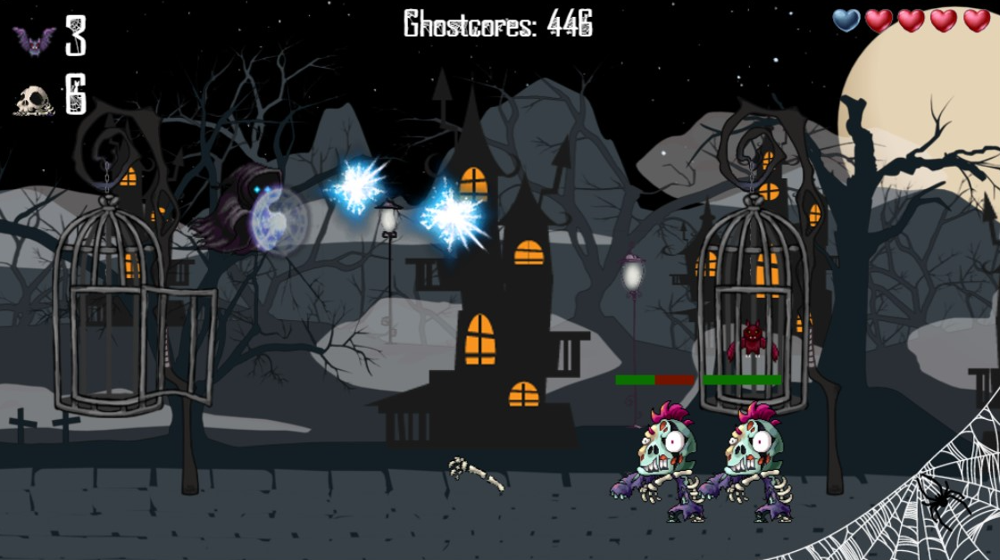

# WonderGhost

¡Bienvenido a WonderGhost! 🕵️‍♂️👻

Este es un proyecto de juego en JavaScript donde acompañas a Wonder Ghost en una aventura para liberar a sus amigos murciélagos atrapados en jaulas experimentales, ¡y enfrentarte a los malvados zombis rockeros creados por el temido Dr. Julius Motauski!

### 📦 ¿Qué necesitas para jugar?
Para jugar a WonderGhost, solo necesitas tener un navegador que soporte JavaScript, ya que el juego está hecho completamente con HTML, CSS y JavaScript.

### 🎮 ¿Cómo jugar?
En WonderGhost, controlarás a nuestro héroe, un valiente fantasma, que se embarca en una misión para liberar a los murciélagos capturados por el malvado villano. A lo largo del camino, deberás enfrentarte a hordas de zombis rockeros y lanzar poderosas *SpiritBombs* para defenderte.

### 💥 Características principales:
- **¡Acción llena de energía!** Lanza poderosas *SpiritBombs* para derrotar a los zombis y liberar a los murciélagos.
- **¡Aventura épica!** Acompaña a WonderGhost por un sombrío cementerio mientras lucha contra criaturas aterradoras.
- **¡Un enfrentamiento final contra el Dr. Julius Motauski!** Prepárate para la batalla más épica en la que tendrás que liberar miles de murciélagos atrapados.

### ⚙️ Tecnologías utilizadas:
- **HTML** 🖥️ para la estructura del juego.
- **CSS** 🎨 para darle un estilo bonito y funcional.
- **JavaScript** ⚡ para toda la lógica y los eventos del juego.

### 🎉 ¡Únete a la aventura!
Haz clic en **Start** para comenzar la acción y ayudar a WonderGhost a liberar a sus amigos.

### 🏆 ¡Desafía tu puntuación!
El juego tiene una tabla de puntuaciones donde puedes ver cuántos murciélagos has liberado y cuántos zombis has derrotado. ¿Podrás llegar a la cima?

### 👨‍💻 Desarrollo:
Este proyecto fue creado por [Leandro Pereyra](https://www.linkedin.com/in/leandropereyradev/). Si deseas colaborar o mejorar el juego, ¡no dudes en hacer un *pull request*!

## 💾 **Descargar el Proyecto**

Puedes clonar o descargar el código fuente desde este [enlace de GitHub](https://github.com/leandropereyradev/WonderGhost).

### 🛠️ ¡Inicia el juego!

Para iniciar el juego, solo tienes que abrir el archivo `index.html` en tu navegador y listo. ¡La diversión está por comenzar!

---

¡Que empiece la aventura! 🦇👻
